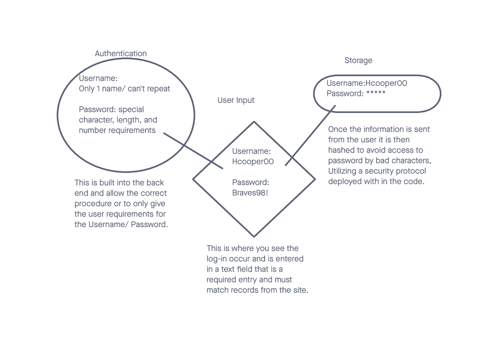

# Project: Basic-Auth

## Author: Hayden Cooper

## Problem Domain

Authentication System Phase 1: Deploy an Express server that implements Basic Authentication, with signup and signin capabilities, using a Postgres database for storage.

## Links and Resources

- [GitHub Actions ci/cd](https://github.com/Hcooper23/api-server/actions)
- [back-end dev server url](https://mainapiserver.onrender.com/)

## Collaborators

 Kenya Womack
 Kao Saelor
 Coriana Williams
 ChatGPT for test development and work arounds for code issues.

## Setup ///

## `.env` requirements (where applicable)

node version "v19.6.1"

## How to initialize/run your application (where applicable)

clone repo, `npm i`, then run `nodemon` in the terminal

## Routes

- Npm Test and install npm Jest if no test runs

## Tests

to run tests, after running `npm i`, run the command `npm test`

## UML

